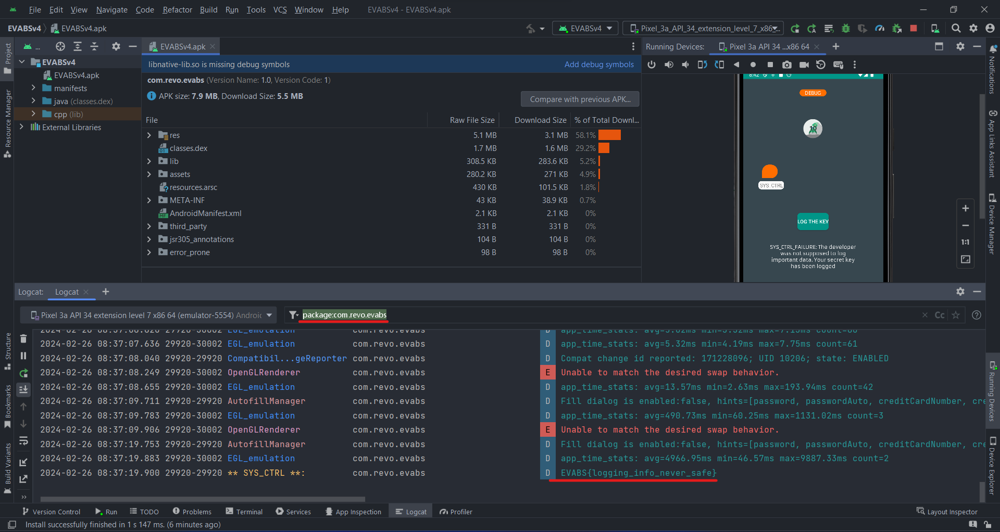

# Level 1

- Decompiled code

```java
// com.revo.evabs.DebugMe
[...]
    @Override // android.view.View.OnClickListener
    public void onClick(View view) {
        switch (view.getId()) {
            case R.id.buttondebug /* 2131361837 */:
                TextView tvdebug = (TextView) findViewById(R.id.textViewdebug);
                tvdebug.setText("SYS_CTRL_FAILURE: The developer was not supposed to log important data. Your secret key has been logged");
                String debugged = stringFromJNI();
                Log.d("** SYS_CTRL **: ", "EVABS{" + debugged + "}");
                return;
            case R.id.buttondebughint /* 2131361838 */:
                TextView tvdebughint = (TextView) findViewById(R.id.textViewdebughint);
                tvdebughint.setText("How do you find the log of running apps in an Android device using ADB?");
                return;
            default:
                return;
        }
    }
[...]
```

- Use logcat (in Android Studio) to view logs

<p align="center">
  
</p>

- Flag: `EVABS{logging_info_never_safe}`