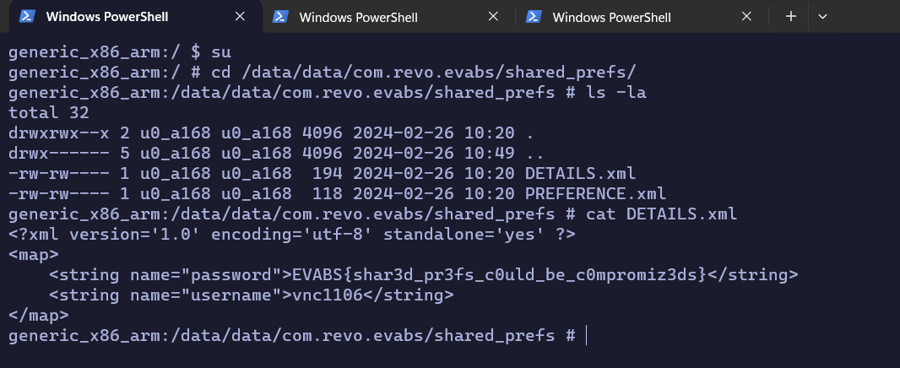

# Level 5

- Decompiled code (Remember the first time you enter this app?)

```java
// com.revo.evabs.Welcome
[...]
    @Override // android.view.View.OnClickListener
    public void onClick(View view) {
        EditText uname = (EditText) findViewById(R.id.editTextname);
        String user = uname.getText().toString();
        if (user.equals("")) {
            Toast.makeText(getApplicationContext(), "Please fill in your hacker handle", 1).show();
            return;
        }
        SharedPreferences sp = getSharedPreferences("DETAILS", 0);
        SharedPreferences.Editor edit = sp.edit();
        edit.putString("username", user);
        edit.putString("password", "EVABS{" + stringFromJNI() + "}");
        edit.commit();
        Toast.makeText(getApplicationContext(), "Launching Mission", 1).show();
        Intent i = new Intent(this, Launch.class);
        startActivity(i);
        finish();
    }
[...]
```

=> `flag` should be saved in `/data/data/com.revo.evabs/shared_prefs/DETAILS.xml`

<p align="center">
  
</p>

- Flag: `EVABS{shar3d_pr3fs_c0uld_be_c0mpromiz3ds}`