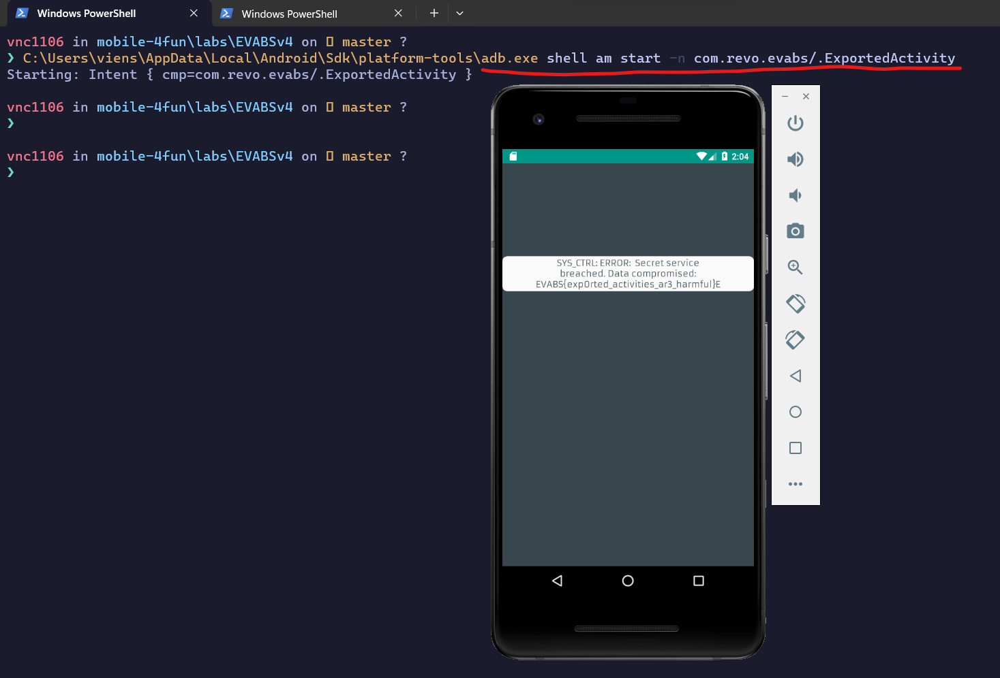

# Level 7

- Decompiled code (Remember the first time you enter this app?)

```java
[...]
// com.revo.evabs.ExportedActivity
public class ExportedActivity extends AppCompatActivity {
    public native String stringFromJNI();

    static {
        System.loadLibrary("native-lib");
    }

    /* JADX INFO: Access modifiers changed from: protected */
    @Override // android.support.v7.app.AppCompatActivity, android.support.v4.app.FragmentActivity, android.support.v4.app.SupportActivity, android.app.Activity
    public void onCreate(Bundle savedInstanceState) {
        super.onCreate(savedInstanceState);
        setContentView(R.layout.activity_exported);
        TextView tv = (TextView) findViewById(R.id.textViewexported);
        tv.setText("SYS_CTRL: ERROR:  Secret service breached. Data compromised:  " + stringFromJNI());
    }
}
[...]
```

=> Exported Activity can be called by other applications. We use `adb` to trigger this activity

<p align="center">
  
</p>

- Flag: `EVABS{exp0rted_activities_ar3_harmful}`