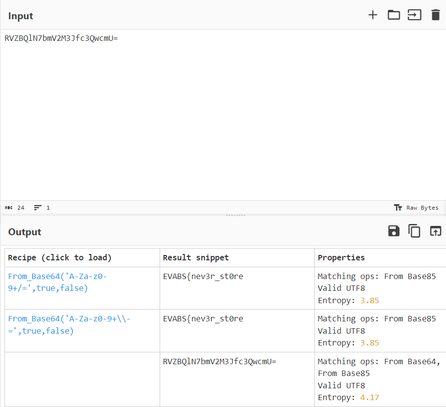

# Level 8

- Decompiled code (Remember the first time you enter this app?)

```java
[...]
// com.revo.evabs.Decode
public class Decode extends AppCompatActivity {
    /* JADX INFO: Access modifiers changed from: protected */
    @Override // android.support.v7.app.AppCompatActivity, android.support.v4.app.FragmentActivity, android.support.v4.app.SupportActivity, android.app.Activity
    public void onCreate(Bundle savedInstanceState) {
        super.onCreate(savedInstanceState);
        setContentView(R.layout.activity_decode);
        String str = "RVZBQlN7bmV2M3Jfc3QwcmU=X3MzbnMhdGl2M19kYXRhXzFuXzdoM19zMHVyY2VjMGRl";
        Button btnhintdeode = (Button) findViewById(R.id.buttonhintdecode);
        final TextView tvdecodehint = (TextView) findViewById(R.id.textViewhintgc);
        btnhintdeode.setOnClickListener(new View.OnClickListener() { // from class: com.revo.evabs.Decode.1
            @Override // android.view.View.OnClickListener
            public void onClick(View view) {
                tvdecodehint.setText("Reversing APK to Java? hmmm..");
            }
        });
    }
}
[...]
```

=> Found this interesting string: `RVZBQlN7bmV2M3Jfc3QwcmU=X3MzbnMhdGl2M19kYXRhXzFuXzdoM19zMHVyY2VjMGRl`, use this [magic tool](https://gchq.github.io/CyberChef/) to decrypt:

- part 1:

<p align="center">
  
</p>

- part 2:

<p align="center">
  
</p>

- Flag: `EVABS{nev3r_st0re_s3ns!tiv3_data_1n_7h3_s0urcec0de}`